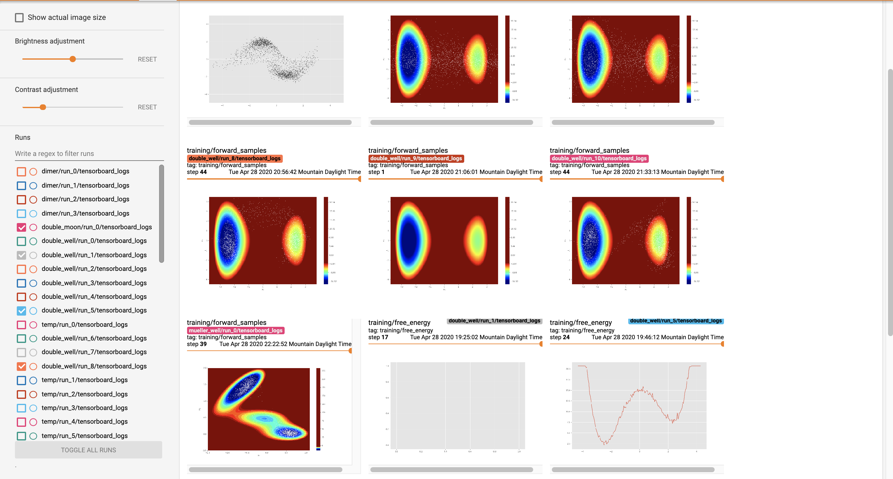
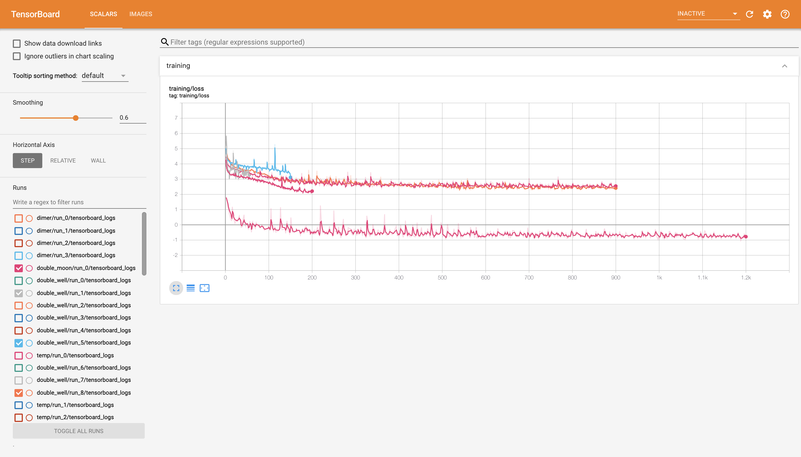
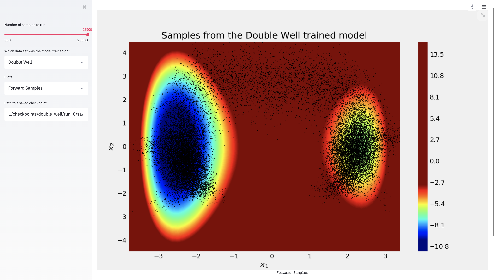

# [Boltzmann Generator](https://science.sciencemag.org/content/365/6457/eaaw1147)
Boltzmann generators are used to sample configurations from different molecular dynamics simulations in a one-shot method. This offers a faster alternative to traditional enhanced sampling methods. The model learns valid configurations under the dynamics of the given simulation using a realNVP network. Real space configrations can be inverse-transformed to a latent gaussian distribution and can easily be sampled through the by the forward transformation of a gaussian distribution. Using these generated samples we can perform rigorous free energy calculations by generating new configurations for the system of interest.

Content
- [Team Members](#team)
- [Requirements](#requirements-and-install)
- [Coding-Example](#code-base-example)
- [Tensorboard](#viewing-the-tensorboard)
- [Streamlit](#running-the-streamlit-application)


## Team: 

**Yash Gandhi**

**Theodore Fobe**

## Requirements and Install
We recommend using virtualenv to install the requirements. We use `python 3.7.4`

#### Install virtualenv
```bash
>> pip3 install -U virtualenv
>> virtualenv --system-site-packages -p python ~/.venv
>> source ~/.venv/bin/activate zsh
```

#### Install Dependencies 
Run the following command inside of boltzmann_generator folder
```bash
>> pip install -r requirements.txt
```


## Code Base Example
Examples of our code can be found inside of the [RealNVP Notebook](notebooks/realNVP.ipynb). The general structure of building a simulation, setting up a model, and training follows these steps:

1.) Select a simulation using a config file and the SimulationData
```python
config = 'path_to_config_file'
sim = core.simulations.simulation.SimulationData(config)
sim.loadSimulation('path_to_saved_npy_file')
# or 
sim.runSimulation()
```

2.) Get the data from the simulation and load the model with a loss function and optimizer
```python
data = sim.getData()
loss = core.getLoss().lossFunction()
opt = core.getOpt().optimizer()
model = RealNVP(loss,opt)
# decorate the model with appropriate Logging decorators here:
model = dec1(model)
model = dec2(model, **kwargs)
```

3.) Build the trainer function and train!
```python
trainer = Trainer(model, data)
trainer.train(20)
```


## Viewing the Tensorboard
To monitor training, the logging decorators push data to a tensorboard and displays values like the ones below:






To view a tensorboard, inside of checkpoints run
```bash
>> tensorboard --logdir=.
```

By specifying which folder or specific run, the results can be narrowed and only information about runs (or run) within that folder will be seen. 

## Running the Streamlit Application
Finally, we provide some simple interactive plots to view trained models through streamlit. Inside of core, run 
```bash
>> streamlit run app.py
```

This will launch a local webapp that allows the user to interact with outputs of models from different simulations. 





Here, streamlit is using a trained model checkpoint on the double moon simulation to output forward samples on top of the known central potential function.
